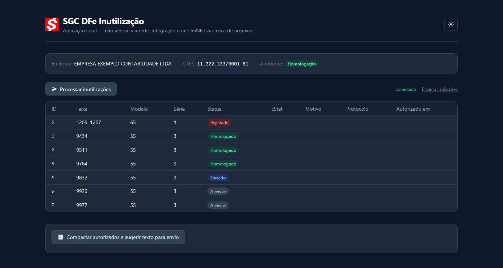
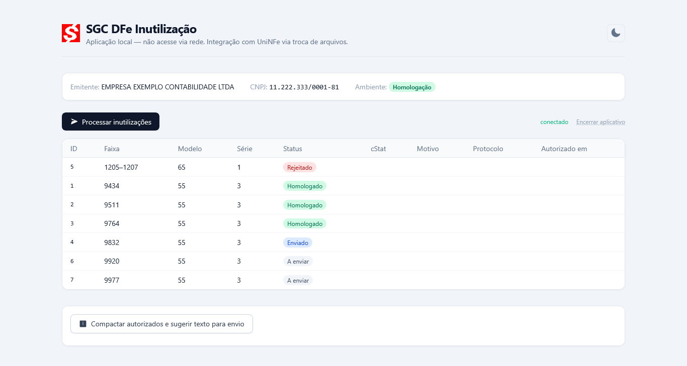
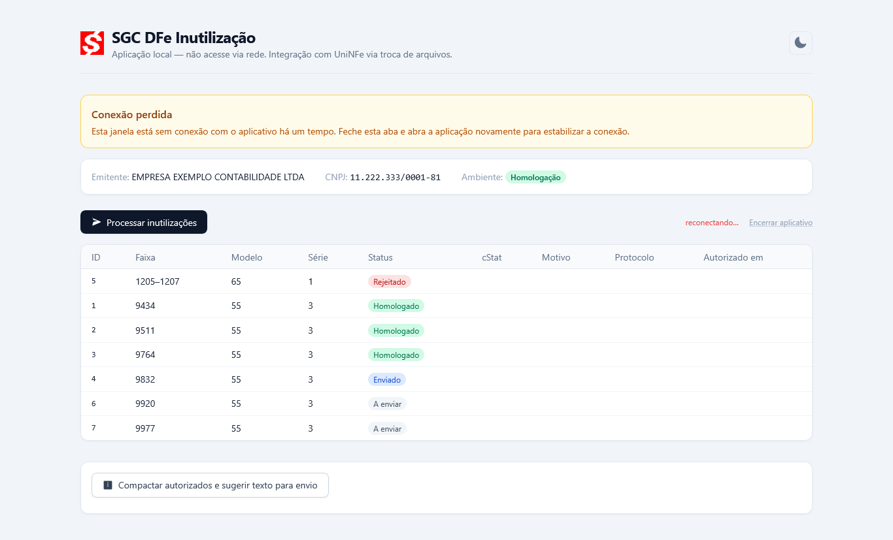
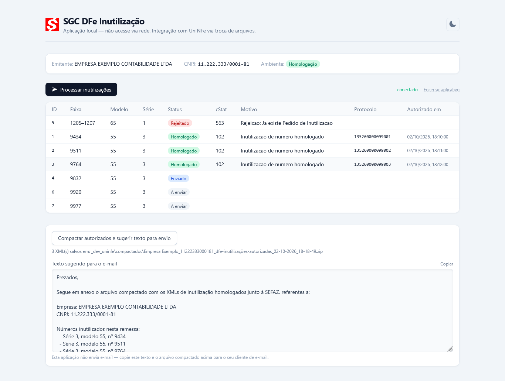
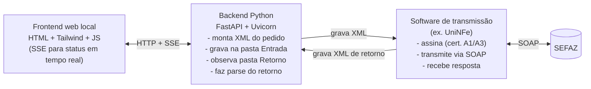

# SGC DFe Inutilização — vitrine técnica

> Este repositório é uma **vitrine curada**, não o código-fonte completo do produto. Ele existe para mostrar arquitetura, decisões de design e qualidade de código de uma aplicação que está **em produção real**, não para ser clonado e rodado como produto acabado. O SGC DFe Inutilização é vendido como serviço (instalação + suporte) — ver contato no fim deste README.

## O que é o produto

Aplicação web local (Python + FastAPI), empacotada em `.exe` para Windows, que automatiza a **Inutilização de Numeração de NF-e/NFC-e** junto à SEFAZ — do preenchimento do pedido ao acompanhamento do resultado em tempo real. Projetada como satélite de **qualquer** sistema de emissão de DF-e já existente (independente de linguagem/plataforma) e de **qualquer** software de transmissão que opere por monitoramento de pastas — os caminhos e convenções de nome de arquivo são 100% configuráveis via JSON, sem nada hardcoded. Validada em produção com o UniNFe (Unimake).

**Em produção real** desde outubro/2026, atendendo um escritório de contabilidade — já homologou lotes reais de inutilização junto à SEFAZ.

### O problema que resolve

Quando uma nota fiscal é gerada mas nunca transmitida (falha local, número pulado, nota cancelada antes do envio), a numeração fica "furada" — a legislação exige que esses números sejam formalmente **inutilizados** junto à SEFAZ, dentro de um prazo mensal, através de um pedido XML assinado digitalmente. Hoje isso é, tipicamente, feito manualmente: localizar a lacuna, montar o XML certo (com um `Id` de 45 caracteres calculado a partir de UF, CNPJ, modelo, série e data), levar para o software de transmissão, e acompanhar se a SEFAZ aceitou. Esta aplicação automatiza tudo isso, exceto a assinatura digital e a transmissão em si — responsabilidade do software de transmissão (ex. UniNFe), que já concentra a custódia do certificado A1/A3.

## Capturas de tela

> Dados de empresa/CNPJ fictícios em todas as imagens — gerados especificamente para esta vitrine, nunca dados de cliente real.

| | |
|---|---|
|  Tabela principal (tema escuro) — status coloridos, atualização em tempo real via SSE |  Mesma tela em tema claro — alternância persistida em `localStorage` |
|  Aviso de reconexão SSE — orienta o usuário em vez de deixar a tela "travada" silenciosamente |  Compactação dos XMLs homologados + texto de e-mail sugerido, pronto para copiar |

## Stack técnica

| Camada | Tecnologia |
|---|---|
| Linguagem | Python 3.11+ |
| Backend web | FastAPI + Uvicorn (embarcado, sem servidor externo) |
| Validação de dados | Pydantic v2 |
| XML | lxml |
| Frontend | HTML5 + Tailwind (CDN) + JavaScript vanilla, sem framework SPA |
| Tempo real | Server-Sent Events (`EventSource`), não WebSocket — unidirecional server→cliente é suficiente para o caso de uso |
| Empacotamento | PyInstaller (`--onefile --windowed`) |
| Testes | pytest — 122 testes no projeto completo |

Sem framework JS pesado, sem banco de dados relacional (volume de dados é baixo — dezenas/centenas de itens por lote; estado em memória do processo + arquivos JSON/XML em disco é suficiente), sem autenticação (aplicação local, single-user).

## Arquitetura

Esta aplicação **nunca** assina digitalmente nem fala diretamente com a SEFAZ — troca apenas arquivos XML em pastas de convenção com o software de transmissão, que concentra toda a responsabilidade de certificado digital e transmissão. Essa troca por pastas (caminhos, sufixos de arquivo) é inteiramente configurável via JSON — a aplicação não depende de nenhum software específico, só foi validada em produção com o UniNFe (Unimake). O desenho completo — schemas, ciclo de vida de uma solicitação, convenções de pastas, empacotamento — está em [`CONTEXT.md`](./CONTEXT.md), documento de arquitetura real do projeto (sanitizado apenas no CNPJ de exemplo e generalizado nas referências ao sistema de emissão/transmissão específicos do caso real).

## Trechos de código

A pasta [`trechos/`](./trechos) traz módulos completos e isolados, escolhidos por ilustrarem bem o nível de cuidado do projeto:

- **[`xml_builder.py`](./trechos/xml_builder.py)** — função pura que monta o XML do pedido de inutilização, incluindo o cálculo do `Id` de 45 caracteres (`CONTEXT.md` §5.1) e a sanitização de texto livre para o schema da SEFAZ.
- **[`instancia_unica.py`](./trechos/instancia_unica.py)** — por que usar `bind()` do sistema operacional como árbitro de instância única, em vez de "perguntar antes" (abordagem anterior que tinha uma condição de corrida real, reproduzida e documentada no próprio código).
- **[`test_xml_builder.py`](./trechos/test_xml_builder.py)** — os testes correspondentes ao primeiro módulo, incluindo validação contra um caso de referência de ponta a ponta.

## Decisões de design que valem a leitura

- **Cálculo do `Id` de 45 caracteres** do pedido de inutilização, validado contra um caso de referência (ver `trechos/test_xml_builder.py` e `CONTEXT.md` §5.1).
- **Instância única do `.exe` via `bind()` de verdade**, não via "pergunta antes" — essa segunda abordagem tem uma condição de corrida real quando duas instâncias sobem quase ao mesmo tempo, reproduzida e documentada em `CONTEXT.md` §11.
- **`--onefile` em vez de `--onedir`** no PyInstaller, para não poluir a pasta de instalação do sistema de emissão principal com centenas de arquivos — trade-off: abertura um pouco mais lenta, aceitável para um uso pontual.
- **Reconexão de SSE**: em vez de lógica de retry customizada, usa o retry nativo do `EventSource`, com um banner de aviso (não um botão que pode levar a uma tela de erro confusa do navegador) quando a reconexão demora demais.
- **Fail-open em toda integração externa**: falha ao falar com o software de transmissão, com uma pasta inacessível, ou qualquer erro de ambiente vira item com status de erro na UI — nunca derruba o processo do servidor.

## Status e próximos passos

- ✅ Em produção real, homologando inutilizações junto à SEFAZ.
- 🚧 **Scanner de Lacunas** — próxima etapa: detecção automática de lacunas de numeração a partir dos XMLs já emitidos, eliminando a conferência manual que hoje antecede o uso desta aplicação. Desenho completo em `CONTEXT.md` §12.

## Contato

Interessado em usar o SGC DFe Inutilização no seu escritório de contabilidade ou empresa?

- E-mail: sergio_ceara@yahoo.com.br
- GitHub: [github.com/sergio-ceara](https://github.com/sergio-ceara)
